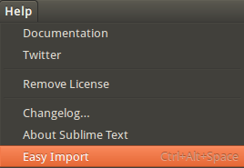
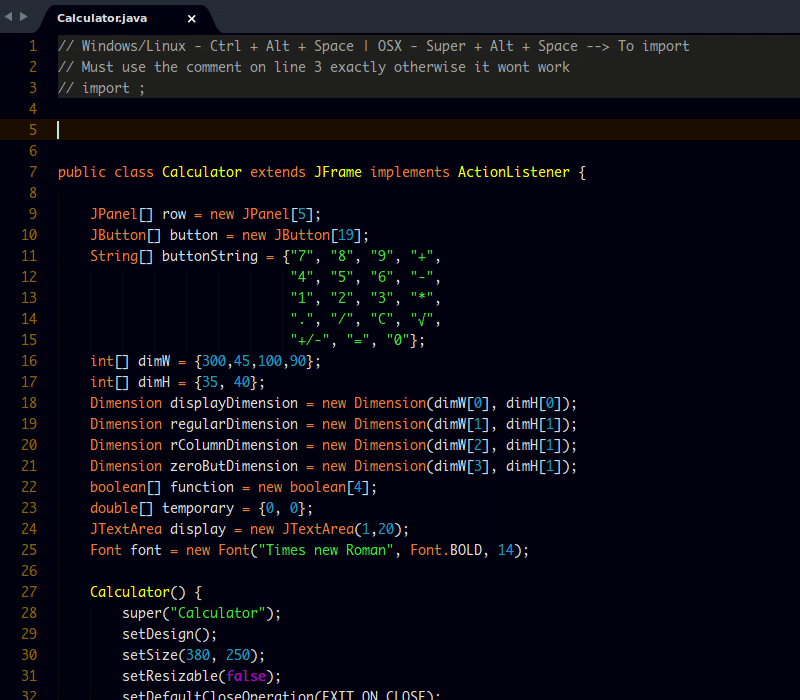

# Easy Import

A sublime text plugin that automatically import required modules/classes/packages, For more info, please check [Easy Import](https://github.com/tushortz/EasyImport) on Github

## Currently Supported Languages

* Java

## Where to find EasyImport Menu



Click on the Sublime text `Menu` –> `Help` –> `Easy Import`.

## Usage

> **IMPORTANT:** You must have a comment at the top of where you want to import all the classes,
In the comment, there must be an `import` word followed by an `empty space` and ends with a `semi-colon` otherwise it will give wierd texts.

Example:
```java
// import ;
```
Then use the key bindings or search `Easy Import` from the command pallette. This will automatically import mostly all packages needed.

### Key Bindings

**Linux/Windows** - `Ctrl` + `alt` + `space`
**OSX** - `Super` + `alt` + `space`

You can also search `Easy Import` in the command pallette



## Contributing

All contributions are welcome. fork LangDocs <https://github.com/tushortz/EasyImport> on Github and create a pull request. Any suggestions or bugs, please let me know.

## Licence

© 2016 Taiwo Kareem | taiwo.kareem36@gmail.com.

**Read license.txt**

## Acknowledgements

I’d first like to say a very big thank you to God my creator. Without him, this wouldn’t be possible.